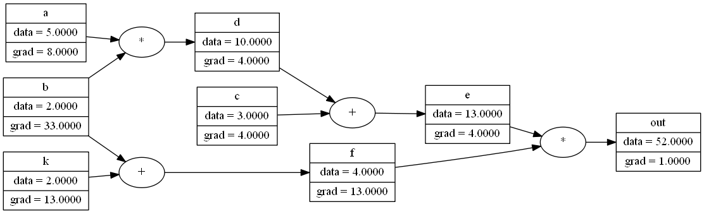
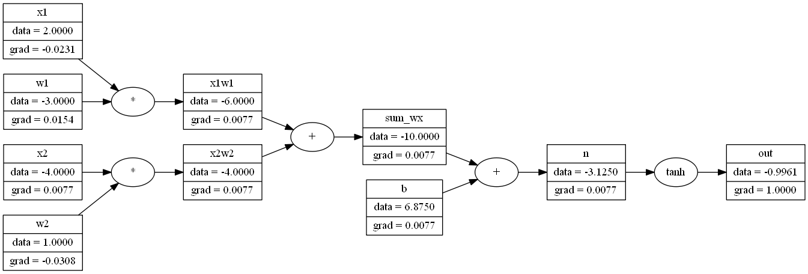
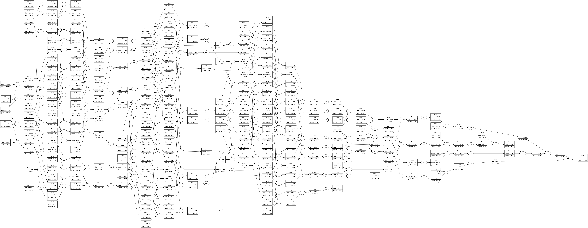

# nanograd
Re-implementation of [micrograd](https://github.com/karpathy/micrograd) by Andrej karpathy for learning purposes. Pytorch api like autograd and neural net library. This is a non-vectorized implementation with little to no performance optimizations. 

## Installation

**For install,**
```
python setup.py install
```

**For force install without dependencies,**
```
pip install --upgrade --force-reinstall --no-deps nanograd
```

**For uninstall,**
```
pip uninstall nanograd
```

If unable to uninstall terminal, vscode or pycharm etc. must be closed or cd to another directory.

## Running Examples

**To run examples any of the following methods should work.**
- Install nanograd via `setup.py` and run directly.
- In pycharm right click on parent nanograd folder and mark it as `Sources Root`. IDE errors will be solved and examples can be run directly without install.
- Add the following on top of each example file and run the file directly from that folder. Installation not required.
  ```
  import sys
  sys.path.append("../..")
  ```
- Move examples out to parent nanograd folder and run. Installation not required.

## Examples

- Computation graph of some functions of a network in `example_vis.py` as well as symbolic derivative calculation example in `example_symbolic.py`. Grads shown here are calculated against `out`.



- Computation graph of single neuron output with activation and grads in `example_neuron.py`.



- Computation graph of of an MLP with multiple layers with 5 layers including input layer and neurons per layer [3, 2, 3, 2, 1]. Minibatch of 4 shown in computation graph with weights as data and grads in `example_nn_minibatch.py`. Grads calculated against the loss output.



- For smaller size networks the computation graph representation can be printed for understanding the opertions in `example_vis.py`. Rich formatted representation and computation graph,
```
ScalarValue(
    data=52.0,
    grad=1.0,
    label='out',
    children=(
        ScalarValue(
            data=13.0,
            grad=4.0,
            label='e',
            children=(
                ScalarValue(
                    data=10.0,
                    grad=4.0,
                    label='d',
                    children=(
                        ScalarValue(
                            data=5.0,
                            grad=8.0,
                            label='a',
                            children=(),
                            op=None
                        ),
                        ScalarValue(
                            data=2,
                            grad=33.0,
                            label='b',
                            children=(),
                            op=None
                        )
                    ),
                    op='*'
                ),
                ScalarValue(
                    data=3,
                    grad=4.0,
                    label='c',
                    children=(),
                    op=None
                )
            ),
            op='+'
        ),
        ScalarValue(
            data=4.0,
            grad=13.0,
            label='f',
            children=(
                ScalarValue(
                    data=2.0,
                    grad=13.0,
                    label='k',
                    children=(),
                    op=None
                ),
                ScalarValue(
                    data=2,
                    grad=33.0,
                    label='b',
                    children=(),
                    op=None
                )
            ),
            op='+'
        )
    ),
    op='*'
)
ScalarValue(data=5.5)
```


## Todo

- Look for mistakes in implementation.
- In visualization model plotting for custom layers show blocks instead of individual neurons.


## References

- https://github.com/karpathy/micrograd
- https://www.youtube.com/watch?v=VMj-3S1tku0
- https://pytorch.org/docs/stable/torch.html
